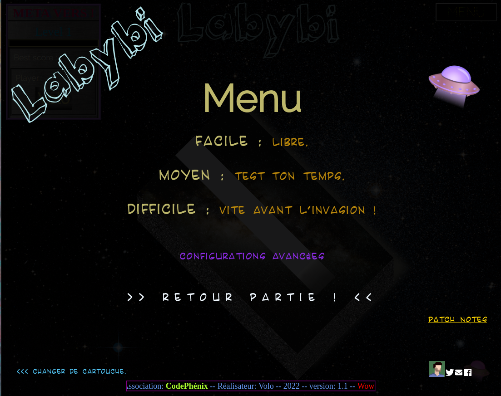

/\ ERRATUM : COMPATIBLE QUE CHROMIUM /\
/\ Jouer en demie-fenêtre de préférence (+fluide etc) /\

__Bienvenue sur ce projet de jeux-vidéo !__ (EDIT: Version finale réparée)

__Si vous voulez ne pas vous divulgacher (spoiler) essayez de jouer et surtout arriver à voir la FIN du jeu ;D__

v 1.0

Cosmetique fin%

menu new record Maj

NewEgg Nom[SECRET][SECRET][SECRET]

cosmétique générique fin

v0.9

fin générique non bloquante (finit le F5 pour rejouer !)

image ReadMe pour GitLab

corrections bugs

changement Menu (+ compréhensible) suite bêta-test

v0.8

générique de fin, déplacement H1

monde rond qui tourne ! (les pros voulaient de la difficulté...)

corrections bugs

curseur soucoup enlevé pour croix sur le menu( suite bêta-test)

v0.7

refont menu

ajout bonus temps pour [SECRET] [SECRET] 

utilisation importante de 'regexATest'.lastindex = 0 pour la fonction test()

EEgg ajoutés [SECRET]

bonton SKIP ajouté (parce que c'est bien mais c'est long le générique StarWars(r)...

v0.6

text flottant 'fin non disponible'

formulaire pseudo

v0.5

ajout titre du jeu

ajout difficulté au Menu pour aider au choix

ajout crédit / générique 

v0.4

animation portes

ajout de textures

ajout de fond d'écran de l'espaaaace
